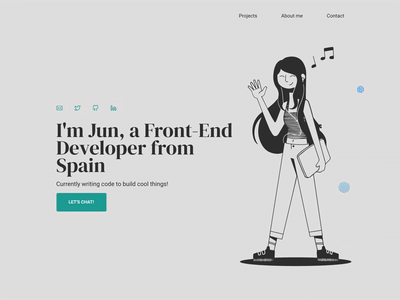
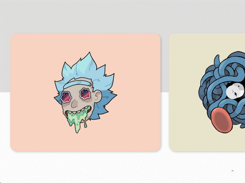
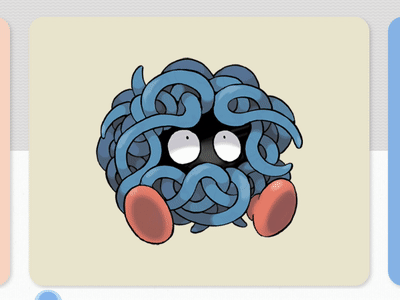

# Jun's Portfolio

- [Installation](##-installation)
- [Description](##-description)
- [Functionalities](##-functionalities)
- [Building Process](##-building-process)
- [License & Copyright](##-license-&-copyright)

---

## Installation

In this project directory, you can run:  
`npm install`  
Installs all the required dependencies to run the project.  
`npm start`  
Runs the app in the development mode. Open [http://localhost:3000](http://localhost:3000/) to view it in the browser.  
The page will reload if you make edits. You will also see any lint errors in the console.  
`npm test`  
Launches the test runner in the interactive watch mode. See the section about [running tests](https://facebook.github.io/create-react-app/docs/running-tests) for more information.  
`npm run build`  
Builds the app for production to the `build` folder. It correctly bundles React in production mode and optimizes the build for the best performance.  
The build is minified and the filenames include the hashes. Your app is ready to be deployed!

---

## Description

Personal site intended as a portfolio where a brief bio and some of my JS and React projects are included.

## Building process

I had the opportunity to work with [Álex](https://twitter.com/alejandrodelpzo), a product designer that not only assisted with the layout of the user interface in this portfolio, but also took into account even the most unexpected detail so that this site could provide an excellent user experience.
Below, I will define the functionalities included and the most challenging issues I have come across when developing the ideas we wanted to implement in this project.

## Functionalities

- [1. React Media Component](###-1.react-media-component)
- [2. React Scroll Component](###-2.-react-scroll-component)
- [3. Animated Hamburger Menu](###-3.-animated-hamburger-menu)
- [4. Slider](###-4.-slider)
- [5. Card-Flip Effect](###-5.-card-flip-effect)
- [6. Local Images from a .JSON File](###-6.-local-images-from-a-.JSON-file)
- [7. Parallax Effect](###-7.-parallax-effect)
- [8. Automatic Background Color on Inputs When Using Autofill Text](###-8.-automatic-background-color-on-inputs-when-using-autofill-text)
- [9. Cursor](###-9.-cursor)

### 1. React-media Component

`react-media` is a CSS media query component for React.
`<Media>` has a `query` prop that will determine which component should be redeemed, based on whether the query matches or not (using a ternary).
On this project, this made it possible having a menu with the options displayed at the upper right corner of the page if the page was checked from a tablet or desktop sized screen, but just displaying a hamburger icon in case it was checked from a smaller device.

**Installation and usage:**

1. Install  
   `$ npm install --save react-media`
2. Import and implement in component  
   `import Media from 'react-media';`
   ```<Media query="(max-width: 768px)">
      {(matches) => {
         return matches ?
            (option A)
         :
            (option B)
      }}
   </Media>
   ```

Full documentation [here](https://www.npmjs.com/package/react-media).

### 2. React Scroll Component



On the desktop version of the site, there is a menu at the upper right corner that allows the user navigating through the page with a smooth scrolling effect. React Scroll Component was installed to create this effect.

**Installation and usage**

1. Install  
   `$ npm install react-scroll`
2. Import and implement in component  
   `import { Link } from 'react-scroll'`  
   Menu
   ```
   <nav>
      <ul>
         <li>
            <Link to="contact">About</Link>
         </li>
         <li>
            <Link to="contact">Contact</Link>
         </li>
      </ul>
   </nav>
   ```
   Content of the page
   ```
   <section id="about">
      <p>Hi there, it's Jun!</p>
   </section>
   ```

### 3. Animated Hamburger Menu

Hamburger menu icon for React with CSS-driven transitions.

**Installation and usage:**

1. Install  
   `npm install hamburger-react`
2. Import and implement in component  
   `import Hamburger from 'hamburger-react';`  
   `<Hamburger size={20} color="#23a79f" />`

Full documentation [here](https://hamburger-react.netlify.app/).

### 4. Slider



**HTML Structure**

```
<div class="wrapper">
   <div class="slider">
      <div class="project"></div>
      <button id="left"></button>
      <button id="right"></button>
   </div>
</div>
```

**CSS Styling**

The property `max-width: 100%` in the `wrapper` layer will hide the projects that do not fit in the screen, making it possible this sliding effect. It will also keep the right button always visible on the right side of the screen.
The `slider` layer will be the container holding the projects as well as the left and right buttons.

**JavaScript Functionality**

When the page loads, the projects will be arranged in their original position. We will set an initial state of `x = 0`, which represent the initial position of the projects in the horizontal axis:
`const [x, setX] = useState(0)`
This `x` will be later replacing the value in the property `transform: translateX()` that is dynamically applied to the `project` elements:

```
<div
   key={index}
   className="project"
   style={{ transform:`translateX(${x}%)` }}
>
...
</div>

```

When the right button is pressed, all the projects will be moving to the left if we apply `setX(x - 100)`.  
On the other hand, it should also be taken into account that the slider should go back to the first project if the user has reached the last project. For this, we can dynamically calculate the length of the projects array as follows:

```
const goRight = () => {
   if (x === 100  * (projects.length  - 1)) {
      setX(0);
   } else {
      setX(x - 100);
   }
```

### 5. Card-Flip Effect



This card-flip effect can be obtained just using CSS!

**HTML Structure**

Three levels of nested <div> elements are required:

```
<div class="container">
   <div class="card">
      <div class="front"></div>
      <div class="back"></div>
   </div>
</div>
```

The first `<div>` element (`container`) will serve as a wrapper for everything. It will hold each of the individual cards.
The `card` container contains two `<div>` elements that are in the same level. One will hold the content on front face of the card (`front`), and the other one will do the same for the back face of the card (`back`).
**CSS Styling**
The `container` level will just need to be styled with a `position: relative` so that we can use absolute position in the nested elements.
The `card` level will be styled with the following properties:

- `position: absolute`
- `transform-style: preserve-3d`: It is used along with the `transform` property. It specifies that the nested elements will preserve its 3D position.
  For the nested `front` and `back` containers, the following properties must be included:
- `position: absolute`
- `backface-visibility: hidden`: The backface-visibility property is useful when an element is rotated. It is set to `visible` by default, which displays a mirror image of the front face when the element (card in this case) is rotated. To avoid this and just see the back face we have styled, this property needs to be set to `hidden`.
- `transition: transform 0.4s linear` for a smooth flipping effect when the card is hovered.
  Finally, the perspective and rotateY values on the transform property must be set for the `front` and `back` layers when their container (`card`) is hovered:

  ```
  .card:hover > front {
        transform: perspective(2000px) rotateY(-180deg);
     }
     .card:hover > back {
        transform: perspective(2000px) rotateY(0deg);
     }
  ```

### 6. Local Images from a .JSON File

1. Change the .JSON file into a .js file.
2. Store the array of objects in a variable:  
   `export const myVariable`.
3. Use `require`function on the path of the image:  
   `require('../images/logo.png')`
4. Import the variable in the Component the image will be used:  
   `import {myVariable} from './folder/file.js'`

### 7. Parallax Effect

In this project, there is a layer with stickers that slightly change their position when the cursor is moved. To create this effect:

1.  All the stickers must have a `data-speed` attribute, which will contain different numbers.
2.  Select all the stickers and apply a translation in the main and cross axis that is calculated from

- the current position of the cursor (`e.pageX` and `e.pageY`)
- and the `data-speed` of each of the stickers.

### 8. Automatic Background Color on Inputs When Using Autofill Text

When selecting any of the suggestions shown from the autofill option list, the text selected is automatically entered in the input area, however the background color is also automatically set to white. This might be inconvenient if we are building a dark theme design website.
To solve this, the `-webkit-autofill` pseudo class will come in handy! In this project, the solution is not as straightforward as changing the background color to transparent, but the following alternative can be used instead:

```
input:-webkit-autofill,
input:-webkit-autofill:hover,
input:-webkit-autofill:focus,
input:-webkit-autofill:active {
   transition: all 10000s ease-in-out;
}
```

A transition with a long duration can be set so that the changes are not visible immediately. The duration has been set to 10000 seconds, which should be long enough so that the user can send the form before the color change can even be perceived.

**Alternatives**

There is a different solution so that the color of the area inside the input can actually be changed. It could be solved by setting an inset box-shadow property of the preferred color:

```
input:-webkit-autofill {
   -webkit-box-shadow:0 0 0 50px black inset;
   -webkit-text-fill-color: white;
}
```

If the color of the input was the same as the background color (i.e. transparent), we could set the color in the background of the input to transparent as well by setting the property `-webkit-background-clip: text` to the input on the CSS file.

```
input {
   -webkit-background-clip: text;
}
```

### 9. Cursor


The regular arrow shaped cursor has been replaced by two circles, one of them with a minor delay effect.  
For this, two `<div>` elements have to be included in the body of the project. To shape them as a circle, they have to be styled in CSS with `border-radius: 50%`. The property `position: absolute` has also been added so that the cursors can be placed anywhere on the screen without affecting any of the other elements.  
We would also need to get the position of the cursor movement using `event.pageX` and `event.pageY` and apply those coordinates to the `top` and `left` properties of the cursor with

**JavaScript Functionality:**

```
cursor.style.top = this.state.event.pageY + 'px'
cursor.style.left = this.state.event.pageX + 'px'
```

Finally, to create the slightly delayed effect of the cursor, a `transition: all 0.05s linear` on it would do the trick!

---

## License & Copyright

Development: [Junyi Ji](https://twitter.com/junNeptune)  
Design: [Alejandro del Pozo](https://twitter.com/alejandrodelpzo)

2020
